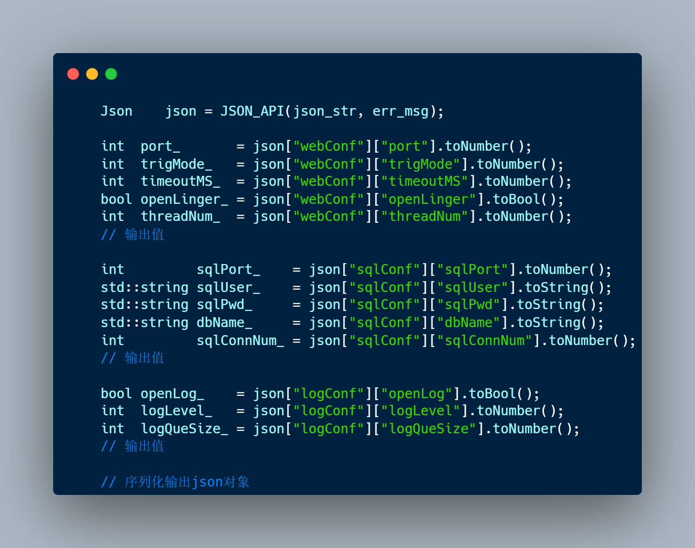
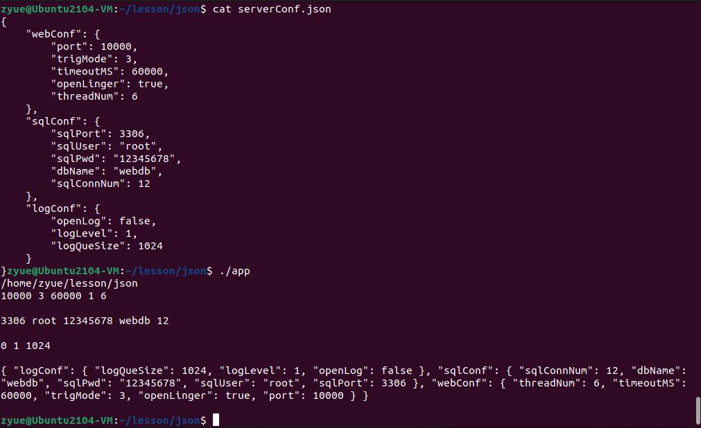

# lightJson

Json文本中就是一些**键值对**，任务是解析出每个值对应的键；

Json值的六种类型：

* `null`: 表示为 `null`
* `boolean`: 表示为 `true` 或 `false`
* `number`: 一般的浮点数表示方式
* `string`: 表示为 `"..."`
* `array`: 表示为 `[ ... ]`（Json对象数组）
* `object`: 表示为 `{ ... }`（Json对象）

像一个树状结构；

## 演示

```c++
编译:	g++ *.cpp -std=c++17 -o app -Wall
运行: ./app
```

测试代码



运行结果



## 代码结构

### 命名空间

```c++
namespace lightJson {}
```

### 值的类型

```c++
/* Json对象的值的类型，限定作用域的枚举类型 */
enum class JsonType { Null, Bool, Number, String, Array, Object };
```

### 共三个类

#### Json类

- 用变体类型`std::variant`保存Json对象的具体类型的值；

- 提供各种接口，如类型判断、序列化(注意转义字符)等等；

- 用智能指针管理变体类型变量，在构造函数中初始化它；
- 自定义了拷贝构造函数，移动构造函数，重载了赋值运算符；

```c++
using jsonArray  = std::vector<Json>;                      // Json数据类型中的 Array
using jsonObject = std::unordered_map<std::string, Json>;  // Json数据类型中的 Object

/* 变体类型, json对象的类型就是其中之一*/
using type = std::variant<std::nullptr_t, bool, double, std::string, jsonArray, jsonObject>;
```

- 因为初始化 `std::unique_ptr` 中需要静态检测类型的大小，要处理好前置声明；

#### JsonParser类

- 解析器类，解析字符串格式的Json文本，并转为Json类对象；
- 检查各类型的合法性，解析`Array`和`Object`类型时**递归**处理；

#### JsonException类

管理异常，遇到非法格式时输出错误信息；

## 参考及致谢

[@Arthur940621](https://github.com/Arthur940621/myJson)

按照大佬的详细文档介绍进行的，减少了部分接口实现，合并Json与JsonValue类为一个Json类；